# 🚗 Ford Advantage — Plataforma de Inteligência Competitiva Automotiva

> Projeto desenvolvido para a disciplina de Mobile Application Development  
> FIAP

---

## 👥 Integrantes do Grupo

| Nome | RM |
|---|---|
| Renato Luiz Cordão | RM 556403 |
| Vitor Victorino Couto | RM 554965 |
| Victoria Moura | RM 555474 |
| Fabricio Bettarello | RM 554638 |
| Enzo Miletta | RM 98677 |

---

## 📱 Sobre o Projeto

O **Ford Advantage** é um aplicativo mobile desenvolvido em **React Native com Expo**, criado com o objetivo de apoiar vendedores Ford e clientes interessados na **Ford Ranger Raptor**.

A ideia surgiu da necessidade de ter uma ferramenta prática e rápida na palma da mão, que ajudasse tanto o vendedor na hora de argumentar no showroom, quanto o cliente a entender melhor as diferenças entre os veículos do mercado.

---

## 🎯 Objetivo

Desenvolver uma plataforma de inteligência competitiva que:

- Compare a Ranger Raptor com seus principais concorrentes de forma visual e objetiva
- Forneça argumentos de venda personalizados por perfil de cliente
- Treine vendedores para contornar objeções comuns
- Ajude clientes a identificar qual veículo combina com seu perfil de uso

---

## 🔧 Tecnologias Utilizadas

- **React Native** — framework principal
- **Expo** — ambiente de desenvolvimento e build
- **TypeScript** — tipagem estática
- **Expo Linear Gradient** — efeitos visuais de gradiente
- **React Navigation** — navegação entre telas
- **Context API** — gerenciamento de estado global

---

## 📂 Estrutura do Projeto

```
ford-advantage/
├── src/
│   ├── screens/          # Telas do app
│   ├── components/       # Componentes reutilizáveis
│   ├── context/          # Contexto global (AppContext)
│   ├── data/             # Dados estáticos (constants, vehicles.json)
│   ├── services/         # Lógica de busca e serviços
│   ├── styles/           # StyleSheets separados por tela
│   └── navigation/       # Configuração de rotas
├── app.json
├── eas.json          # Perfis de build (EAS Build)
├── package.json
└── README.md
```

---

## 🚀 Funcionalidades

### Para Clientes (`home-customer`)
- **Comparador Inteligente** — compara a Ranger Raptor com Toyota Hilux, Chevrolet S10, Ram Rampage e Mitsubishi L200
- **Quiz de Perfil** — identifica o perfil do usuário (aventureiro, familiar, racional, etc.) e exibe a compatibilidade com a Raptor
- **Histórico** — registro das comparações e quizzes realizados

### Exclusivo para Vendedores Ford (`home-ford`)
- **BattleCard** — análise estratégica da Raptor frente à concorrência
- **Argumentos por Perfil** — argumentos de venda adaptados ao tipo de cliente
- **Objeções do Cliente** — respostas prontas para as dúvidas e resistências mais comuns
- **Simulador de Venda** — simula cenários reais de atendimento com feedback de chance de conversão
- **Busca Livre** — pesquisa de especificações técnicas dos modelos Ford disponíveis na base

---

## 🗂️ Dados Utilizados

Os dados técnicos dos veículos foram estruturados manualmente com base em especificações oficiais dos fabricantes. Os arquivos principais são:

- `constants.ts` — specs da Raptor, concorrentes, perfis de cliente, objeções e cenários de venda
- `vehicles.json` — dados detalhados das versões Ford (Raptor, XLT, Limited, Limited+)

---

## ▶️ Como Rodar o Projeto

### Pré-requisitos
- Node.js instalado
- Expo CLI instalado (`npm install -g expo-cli`)
- App **Expo Go** no celular (ou emulador configurado)

### Passo a passo

```bash
# 1. Clone o repositório
git clone https://github.com/VicxMouraM/ford-advantage

# 2. Entre na pasta do projeto
cd ford-advantage

# 3. Instale as dependências
npm install

# 4. Rode o projeto
npx expo start
```

Escaneie o QR Code com o **Expo Go** no seu celular e pronto! 🎉

---

## 📲 Instalar o APK (Build EAS)

O build final da aplicação é gerado através do **EAS Build (Expo Application Services)**, no formato **APK** para Android.

### Gerando o build

```bash
# 1. Login na conta Expo (uma vez só)
npx eas-cli login

# 2. Gerar o APK (perfil "preview")
npm run build:android:apk
```

O comando usa o perfil `preview` definido em [`eas.json`](eas.json) (`buildType: apk`, distribuição interna). Ao final, o EAS gera um link de download e um QR Code no [dashboard do EAS](https://expo.dev/).

### Opção 1 — Via APK (Android)

1. Baixe o arquivo `.apk` pelo link gerado no build
2. Habilite a instalação de apps de fontes desconhecidas (**Configurações > Segurança**)
3. Abra o arquivo baixado e conclua a instalação

🔗 **Download do APK:** [ford-advantage.apk (v1.0.0)](https://github.com/VicxMouraM/ford-advantage/releases/download/v1.0.0/ford-advantage.apk) · [Página do release](https://github.com/VicxMouraM/ford-advantage/releases/latest)

### Opção 2 — Via QR Code (Expo Go / Dashboard EAS)

1. Acesse o [dashboard do EAS](https://expo.dev/) e localize o build do projeto
2. Escaneie o QR Code exibido no dashboard com a câmera do celular
3. Aguarde o download e a instalação do app

---

## 🔐 Acesso ao App

O app possui dois tipos de login (modo demo, sem autenticação real):

- **Entrar como Ford** → acesso completo, incluindo ferramentas exclusivas para vendedores
- **Entrar como Cliente** → acesso ao comparador e quiz de perfil

---

## 📸 Telas do App

<table>
<tr>
<td align="center"><br/><b>Splash</b><br/>Animação de abertura com logo Ford</td>
<td align="center"><br/><b>Login</b><br/>Seleção de perfil (Ford ou Cliente)</td>
<td align="center">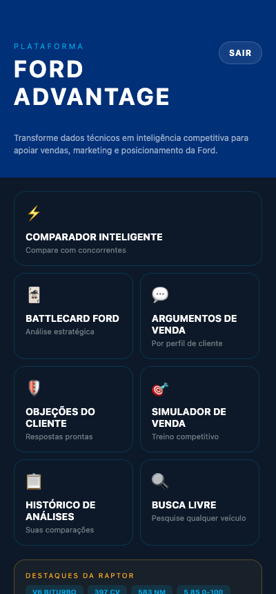<br/><b>Home Ford</b><br/>Menu completo para vendedores</td>
<td align="center">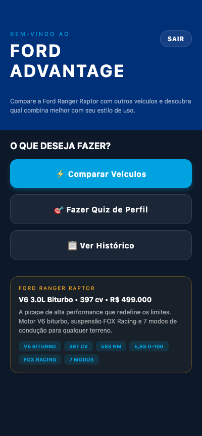<br/><b>Home Cliente</b><br/>Atalhos para comparador e quiz</td>
</tr>
<tr>
<td align="center">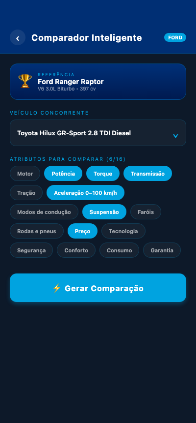<br/><b>Comparador</b><br/>Seleção de concorrente e atributos</td>
<td align="center">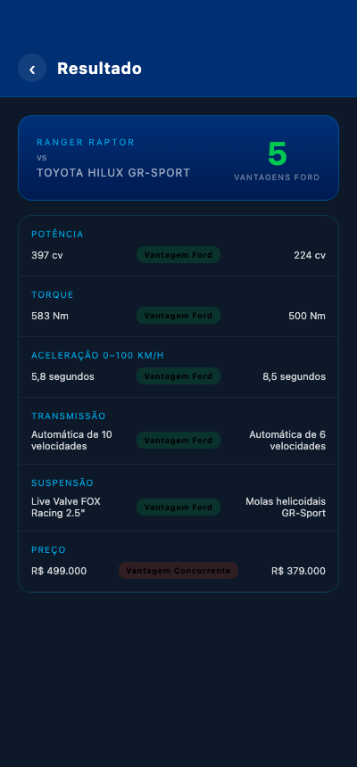<br/><b>Resultado</b><br/>Vantagens Ford exibidas visualmente</td>
<td align="center">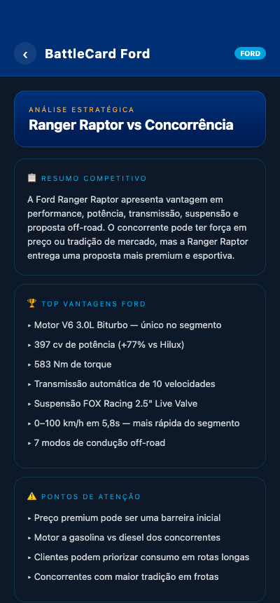<br/><b>BattleCard</b><br/>Resumo estratégico da Raptor</td>
<td align="center">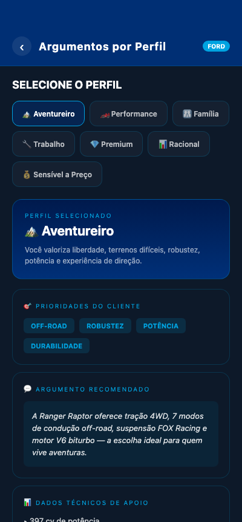<br/><b>Argumentos</b><br/>Argumentos de venda por perfil</td>
</tr>
<tr>
<td align="center">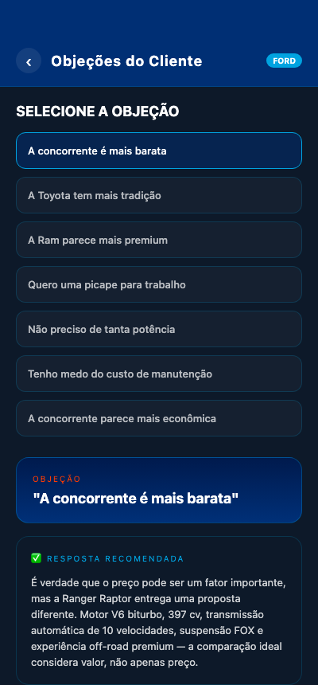<br/><b>Objeções</b><br/>Resposta para cada objeção do cliente</td>
<td align="center">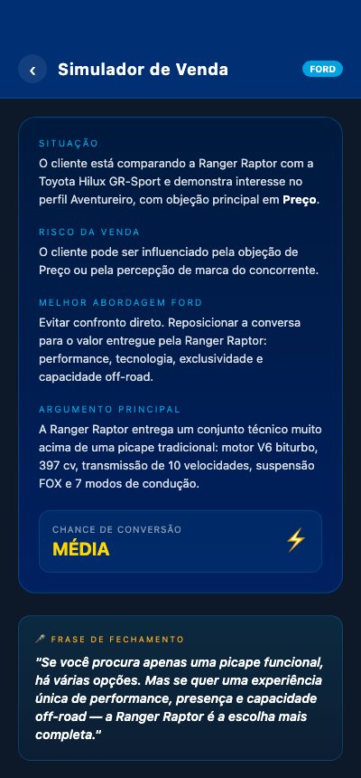<br/><b>Simulador</b><br/>Simulação de cenário de venda</td>
<td align="center">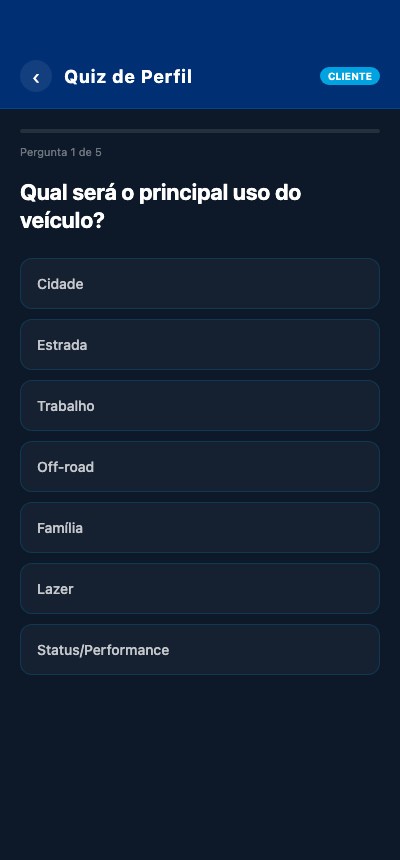<br/><b>Quiz</b><br/>Questionário de perfil para clientes</td>
<td align="center">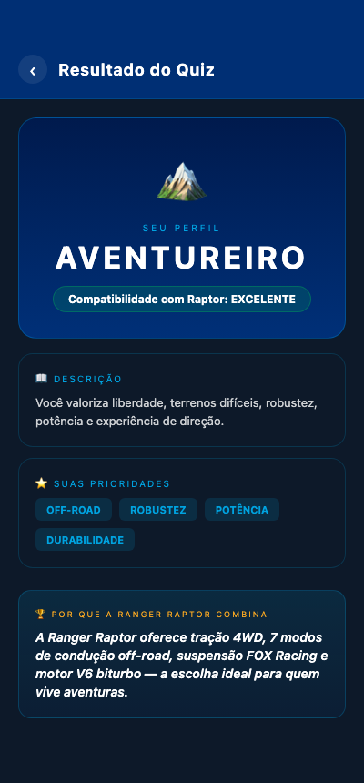<br/><b>Resultado do Quiz</b><br/>Perfil identificado e compatibilidade</td>
</tr>
<tr>
<td align="center">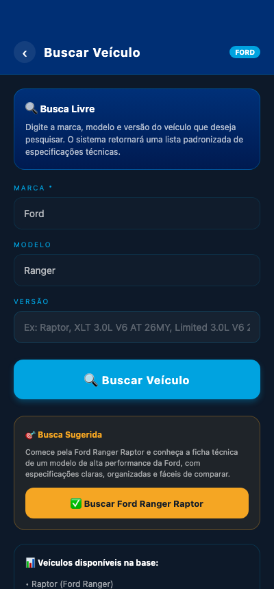<br/><b>Busca Livre</b><br/>Pesquisa de versões Ford na base</td>
<td align="center">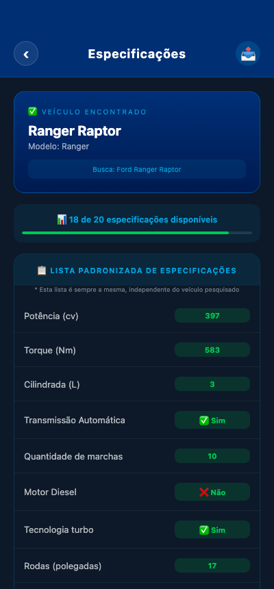<br/><b>Especificações</b><br/>Lista padronizada de specs</td>
<td align="center">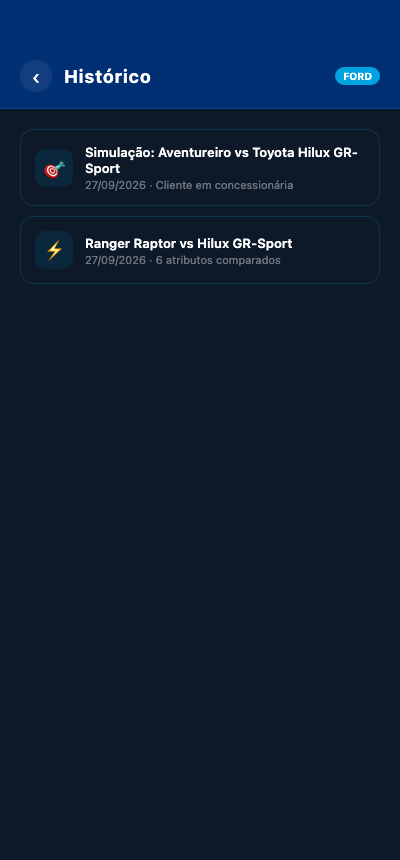<br/><b>Histórico</b><br/>Log das ações realizadas no app</td>
<td></td>
</tr>
</table>

---

## 💡 Decisões de Projeto

- Optamos por usar **Context API** em vez de Redux pela simplicidade do projeto, já que o estado é relativamente simples e centralizado
- Os dados foram **hardcoded** (sem backend) para garantir funcionamento offline — futuramente poderíamos integrar com uma API da Ford
- A separação de **StyleSheets por arquivo** foi escolhida para manter o código organizado, já que o projeto cresceu bastante em número de telas
- O sistema de **navegação customizado** (screen map no AppContext) foi usado para evitar complexidade extra com navigation props passando entre muitas telas

---

## 🧠 Aprendizados

Durante o desenvolvimento desse projeto aprendemos na prática:

- Estruturar um app React Native com TypeScript do zero
- Gerenciar estado global com Context API
- Criar componentes reutilizáveis e organizados
- Trabalhar com LinearGradient para UI mais elaborada
- Separar responsabilidades entre dados, serviços e apresentação
- Simular fluxos reais de aplicativo (login, navegação, histórico)

---

## 📎 Repositório

🔗 [https://github.com/VicxMouraM/ford-advantage](https://github.com/VicxMouraM/ford-advantage)

---
